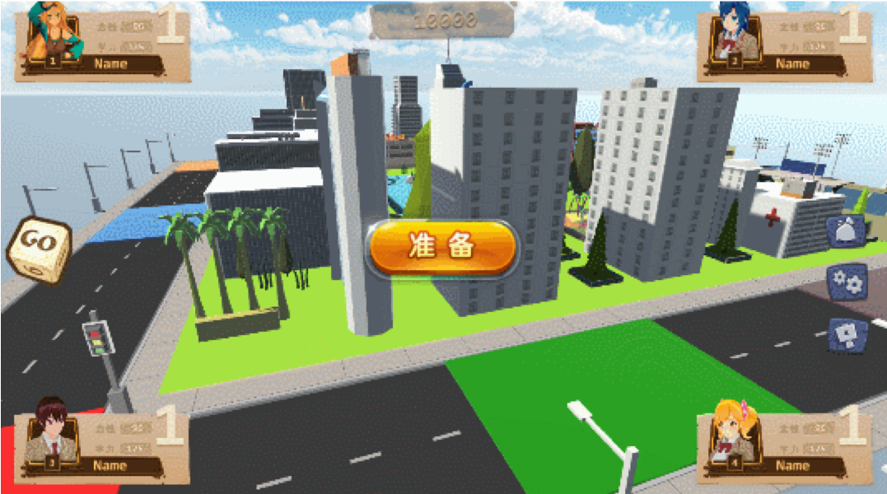
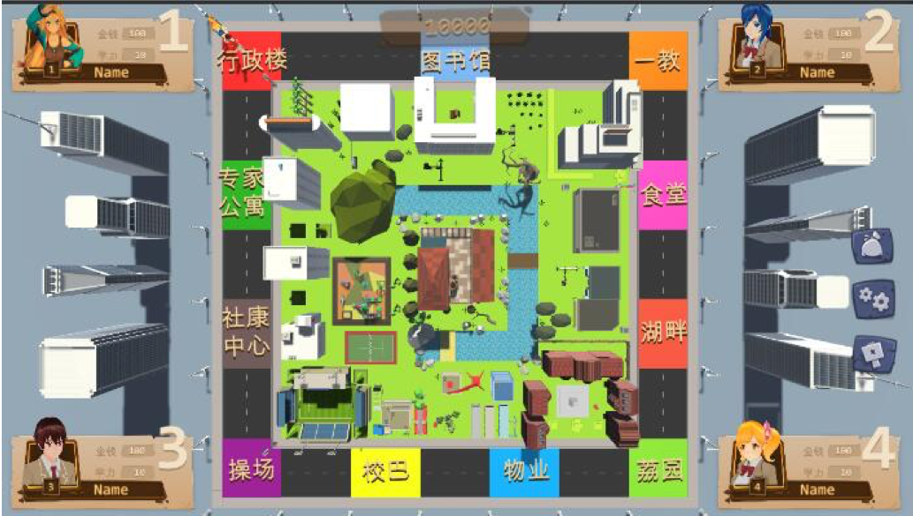
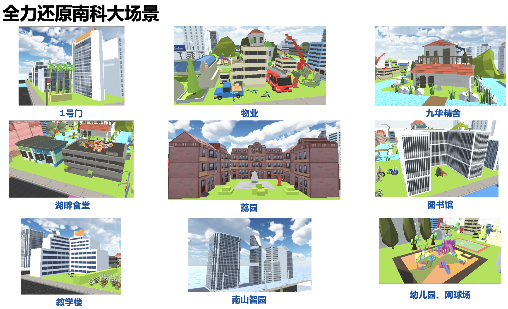
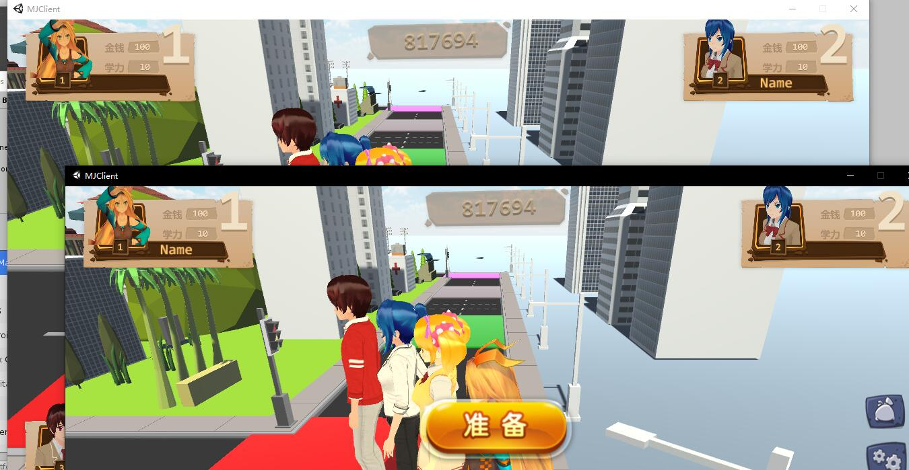
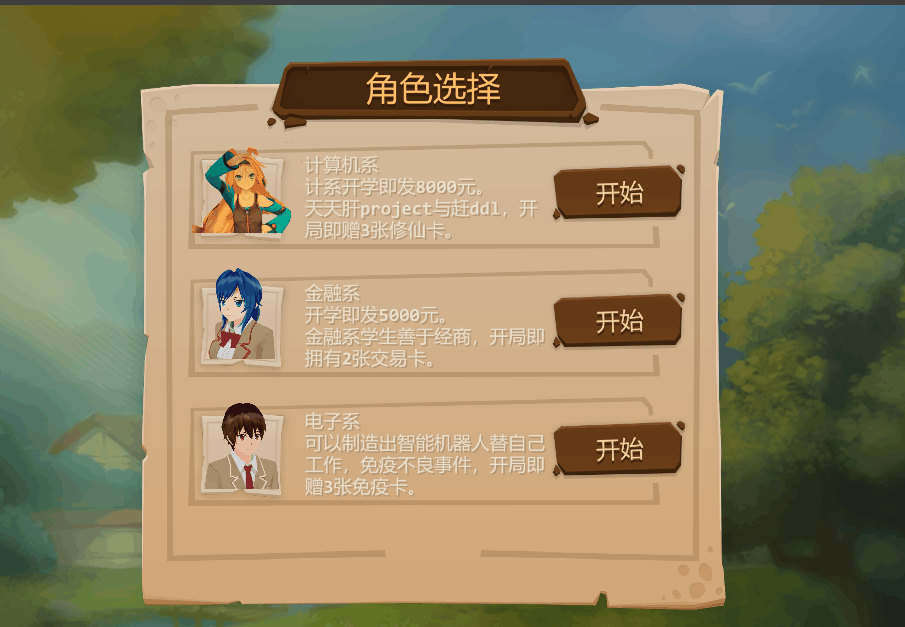
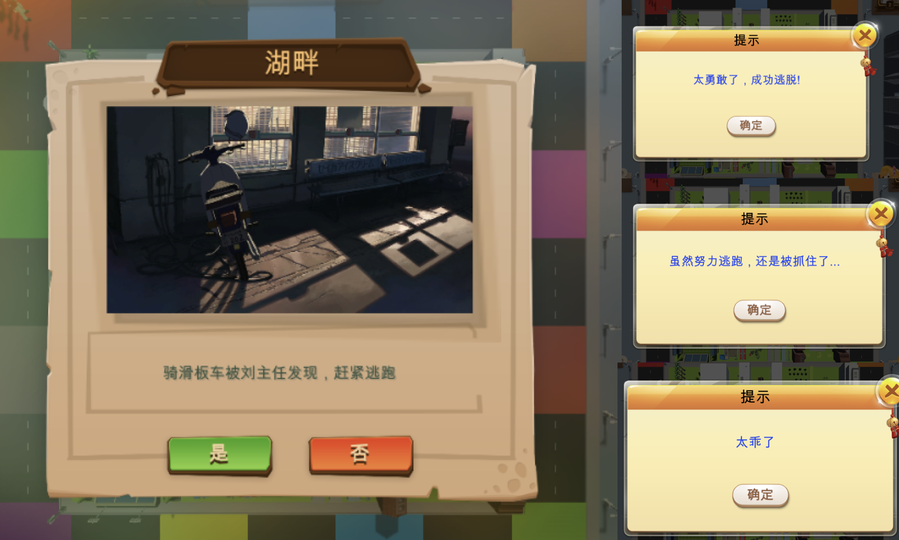
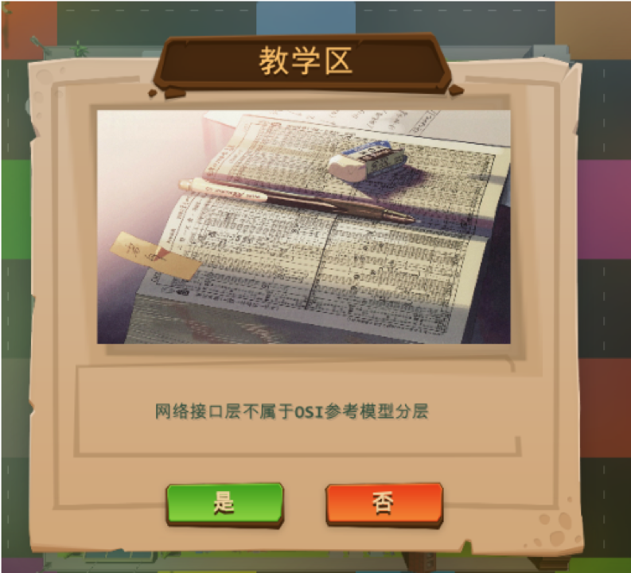
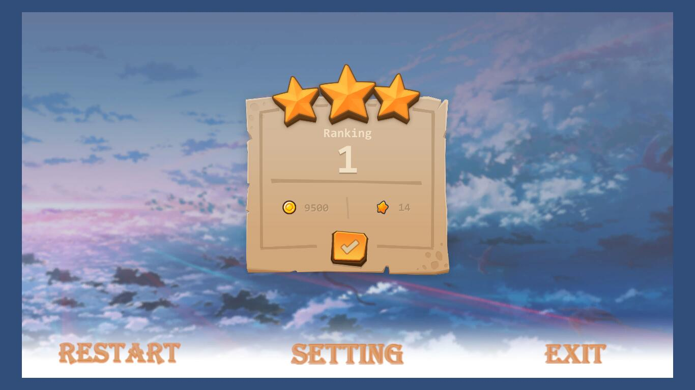
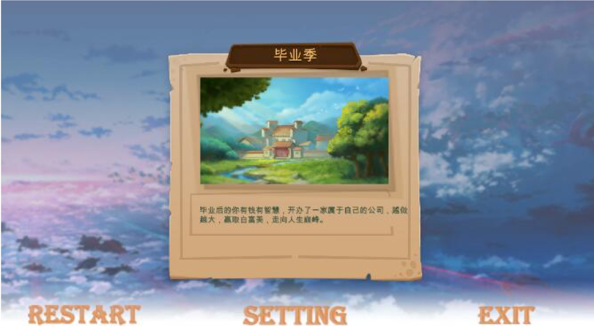

南科大富翁 SUSTech Monopoly
===

#### Final project of OOAD CS309

This repository is the asset library of the sever using KBEngine as sever engine.

## Client

	Unity 3D (C#)

### Overview

# Usage

## Start the sever

	Linux:
		start_server.sh

	Windows:
		start_server.bat

## Kill the sever

	Linux:
		kill_server.sh

	Windows:
		kill_server.bat

# In-Game

## Create and Join room by room id

Player could choose whether create a room whose room id is randomly generated by the sever or join an exist room by room id.

## Choose Character

After creating or joining a room, the player is asked to choose a character.

Characters already be chosen would be unable to choose for next player.

## Event System

### Quiz

## Ending

Normally, the rank and wealth a player got would be shown in the end.

Cause we have event system, we would generate special endings for every player according to the desisions they made for each event.

